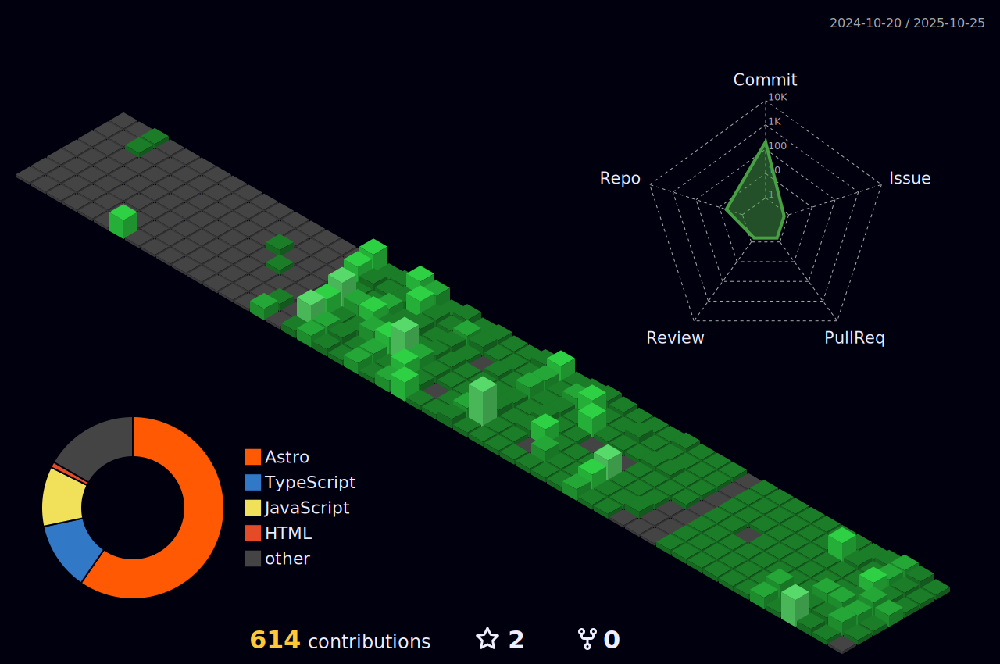

<h1 align="center"><b>Web Developer</b>  I craft scalable and efficient web solutions.</h1>

  Solving problems through code and optimization.

---

	
	
	
	

---

<h3>A Developer in Evolution</h3>

<em>"Code is not just about syntax; it’s about solving real problems."</em>

I started in web development, crafting sites and optimizing digital experiences. But curiosity pushed me beyond templates and plugins. I wanted to understand the why behind the code, the how behind the architecture.

-----

Now, I build, optimize, and refine software with a focus on performance and scalability. My journey isn’t about mastering a single stack—it’s about mastering the art of continuous improvement.

📌 Transforming ideas into scalable digital solutions.

-----
 
 
 

##  Some Languages and Tools 

**💡 Lenguajes:**  

**⚙️ Backend & Databases:**  

   

**🖥️ Frontend & UI:**  

---

**📍 Roadmap | What I'm Working On:**

🔹 **Backend:** Going deeper into **NestJS** and **PostgreSQL**.  
🔹 **Frontend:** Optimizing performance in **Next.js** and exploring new architectures.  
🔹 **DevOps:** Experimenting with **Docker** and efficient deployments.  
🔹 **Strategy:** Building a solid portfolio on GitHub.

 
 
 

------

 

---
 
 

<h2>🎯 My Development Philosophy:</h2>

_"Coding is not just about fixing bugs; it’s about creating scalable, sustainable, and impactful solutions."_ 

<b>⭠If you enjoy my projects, please give them a star. I appreciate your support! 🚀</b>

 

---

 

<h2 align="center"> Have questions or want to collaborate?   Feel free to reach out via any of the platforms below:</h2>

   &nbsp;&nbsp;
  
   &nbsp;&nbsp;

  
   &nbsp;&nbsp;

 

  :heart_eyes: Thanks for visiting my profile! Looking forward to connecting with you! :wink:  
  &copy; 2025 Javier Murúa

